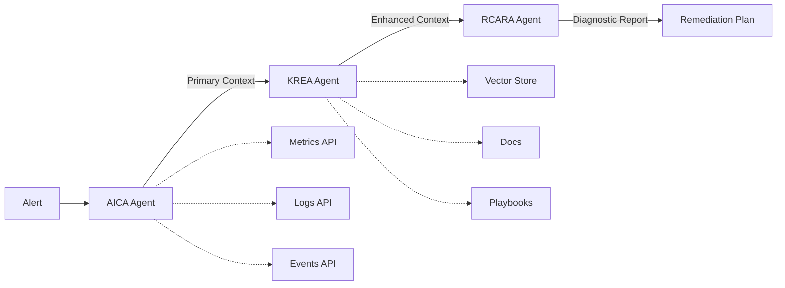

# OpsSage

**Multi-Agent Incident Analysis & Remediation System**

OpsSage is an AI-powered advisory system for incident analysis and remediation recommendations in SRE workflows. It uses a multi-agent architecture built with Google ADK (Agent Development Kit) to provide comprehensive incident analysis through three specialized agents: AICA, KREA, and RCARA.

## Overview

OpsSage implements a deterministic multi-stage pipeline for incident analysis:

```
Alert → AICA → KREA → RCARA → Diagnostic Report
```

1. **AICA** (Alert Ingestion & Context Agent): Analyzes alerts and builds primary context
2. **KREA** (Knowledge Retrieval & Enrichment Agent): Enriches context with relevant knowledge
3. **RCARA** (Root Cause Analysis & Remediation Agent): Performs root cause analysis and generates remediation recommendations

## Features

- **Multi-Agent Architecture**: Modular agents with clear responsibilities following ADK best practices
- **Structured Message Contracts**: Type-safe communication between agents using Pydantic models
- **Shared Context Store**: Thread-safe storage for incident analysis state
- **Capability Adapters**: Pluggable tool interfaces for metrics, logs, events, and knowledge retrieval
- **RAG Pipeline**: Complete retrieval-augmented generation for document ingestion and semantic search
- **Vector Store**: ChromaDB-based knowledge base with semantic similarity search
- **Document Management**: Upload, search, and manage runbooks, playbooks, and documentation
- **RESTful API**: FastAPI-based server with health checks and incident management endpoints
- **Web Dashboard**: Modern React-based UI for managing alerts, incidents, and documents
- **Kubernetes-Native**: Helm charts and manifests for production deployment
- **Comprehensive Testing**: Unit tests, integration tests, and API tests
- **CI/CD Pipeline**: Automated testing, linting, and deployment via GitHub Actions

## Architecture

### Agent Pipeline



### Components

- **Agents** (`sages/subagents/`): AICA, KREA, RCARA agent implementations
- **Models** (`sages/models.py`): Pydantic models for message contracts
- **Tools** (`sages/tools.py`): Capability adapters for external systems
- **Context Store** (`sages/context_store.py`): Shared state management
- **Orchestrator** (`sages/orchestrator.py`): Coordinates agent pipeline
- **API** (`apis/`): FastAPI server for external access

## Quick Start

### Prerequisites

- Python 3.10+ (3.13 recommended)
- [uv](https://github.com/astral-sh/uv) for dependency management
- Google Cloud credentials (for Google ADK and Gemini models)

### Installation

```bash
# Clone the repository
git clone https://github.com/ithaquaKr/opssage.git
cd opssage

# Install dependencies using uv
uv sync

# Set up environment variables
cp env.example .env
# Edit .env with your Google Cloud credentials
```

### Running the Backend

```bash
# Activate virtual environment
source .venv/bin/activate

# Run the FastAPI server
uvicorn apis.main:app --reload

# The API will be available at http://localhost:8000
```

### Running the Dashboard

```bash
# Navigate to dashboard directory
cd dashboard

# Install dependencies (first time only)
npm install

# Start development server
npm run dev

# The dashboard will be available at http://localhost:3000
```

See [dashboard/README.md](dashboard/README.md) for detailed dashboard documentation.

### Running with Docker

```bash
# Build the Docker image
docker build -t opssage:latest .

# Run the container
docker run -p 8000:8000 \
  -e GOOGLE_APPLICATION_CREDENTIALS=/path/to/credentials.json \
  opssage:latest
```

## Usage

### Ingesting an Alert

```bash
curl -X POST http://localhost:8000/api/v1/alerts \
  -H "Content-Type: application/json" \
  -d '{
    "alert_name": "HighCPUUsage",
    "severity": "critical",
    "message": "CPU usage above 90% for 5 minutes",
    "labels": {
      "service": "api-server",
      "namespace": "production",
      "pod": "api-server-7d8f9b-xyz"
    },
    "firing_condition": "cpu_usage > 90"
  }'
```

### Response

```json
{
  "incident_id": "123e4567-e89b-12d3-a456-426614174000",
  "status": "completed",
  "diagnostic_report": {
    "root_cause": "Memory leak causing excessive CPU usage",
    "reasoning_steps": [...],
    "supporting_evidence": [...],
    "confidence_score": 0.85,
    "recommended_remediation": {
      "short_term_actions": [
        "Restart the affected pod",
        "Monitor CPU and memory usage"
      ],
      "long_term_actions": [
        "Fix memory leak in application code",
        "Implement better monitoring"
      ]
    }
  }
}
```

### Retrieving an Incident

```bash
curl http://localhost:8000/api/v1/incidents/{incident_id}
```

### Listing All Incidents

```bash
# List all incidents
curl http://localhost:8000/api/v1/incidents

# Filter by status
curl http://localhost:8000/api/v1/incidents?status=completed
```

## Development

### Project Structure

```
opssage/
├── sages/                  # Core agent package
│   ├── subagents/         # Agent implementations
│   │   ├── aica.py       # Alert Ingestion & Context Agent
│   │   ├── krea.py       # Knowledge Retrieval & Enrichment Agent
│   │   └── rcara.py      # Root Cause Analysis & Remediation Agent
│   ├── rag/              # RAG pipeline components
│   │   ├── embeddings.py      # Embedding service
│   │   ├── document_processor.py  # Document processing
│   │   └── vector_store.py    # Vector store integration
│   ├── models.py          # Pydantic models for message contracts
│   ├── tools.py           # Capability adapters
│   ├── context_store.py   # Shared context store
│   ├── orchestrator.py    # Pipeline orchestration
│   └── configs.py        # Configuration
├── apis/                  # FastAPI application
│   ├── main.py           # API server and routes
│   └── documents.py      # Document management API
├── dashboard/            # React web dashboard
│   ├── src/             # Source code
│   │   ├── pages/       # Page components
│   │   ├── components/  # Reusable components
│   │   ├── api/         # API client
│   │   └── types/       # TypeScript types
│   └── README.md        # Dashboard documentation
├── tests/                # Test suite
├── deploy/              # Deployment configurations
│   └── helm/           # Helm charts
├── docker/             # Docker configurations
├── docs/               # Documentation
└── pyproject.toml      # Project metadata and dependencies
```

### Running Tests

```bash
# Run all tests
uv run pytest

# Run with coverage
uv run pytest --cov=sages --cov-report=html

# Run specific test file
uv run pytest tests/test_models.py
```

### Linting and Formatting

```bash
# Run ruff linter
uv run ruff check sages tests

# Auto-fix issues
uv run ruff check --fix sages tests

# Format code
uv run ruff format sages tests

# Type checking
uv run mypy sages
```

## Deployment

### Docker Compose (Recommended for Local Testing)

Quick start with Docker Compose for complete local environment:

```bash
# Automated setup
make setup          # or ./scripts/dev-setup.sh

# Build and start all services
make run            # or docker-compose up -d

# Access services
# Dashboard:    http://localhost:3000
# Backend API:  http://localhost:8000
# Prometheus:   http://localhost:9090
# Grafana:      http://localhost:3001
```

See [Docker Compose Guide](docs/DOCKER_COMPOSE_GUIDE.md) for detailed documentation.

### Kind (Kubernetes in Docker) - Multi-Node Testing

Test OpsSage on a real Kubernetes cluster locally:

```bash
# Create Kind cluster (1 control plane + 3 worker nodes)
make kind-setup     # or ./scripts/kind-setup.sh

# Build and deploy to Kind
make kind-deploy    # or ./scripts/kind-deploy.sh

# Access services (via NodePort)
# Backend:   http://localhost:8000
# Dashboard: http://localhost:3000

# Cleanup
make kind-teardown  # or ./scripts/kind-teardown.sh
```

See [Kind Guide](docs/KIND_GUIDE.md) for detailed documentation.

### Kubernetes with Helm (Production)

```bash
# Install OpsSage using Helm
helm install opssage ./deploy/helm \
  --set image.tag=0.1.0 \
  --set googleCloud.projectId=your-project-id

# Upgrade deployment
helm upgrade opssage ./deploy/helm

# Uninstall
helm uninstall opssage
```

### Deployment Modes Comparison

| Feature | Docker Compose | Kind | Production K8s |
|---------|---------------|------|----------------|
| Use Case | Development | Testing | Production |
| Setup Time | 1-2 min | 3-5 min | 15-30 min |
| Kubernetes | ❌ | ✅ | ✅ |
| Multi-Node | ❌ | ✅ (4 nodes) | ✅ |
| Resource Usage | Low (2GB) | Medium (4GB) | High |
| Cost | Free | Free | $$$ |

### Configuration

Key configuration options in `deploy/helm/values.yaml`:

- `replicaCount`: Number of replicas (default: 2)
- `resources`: CPU and memory limits
- `autoscaling`: HPA configuration
- `policy.allowAutoRemediate`: Enable/disable auto-remediation (default: false)
- `googleCloud`: Google Cloud configuration

**Important Policy Note**: By default, OpsSage requires manual approval for all remediation actions. To enable automatic remediation, update `policy.allowAutoRemediate` to `true` in your Helm values. However, this is not recommended for production environments without additional safeguards.

## Knowledge Base & RAG

OpsSage includes a complete RAG (Retrieval-Augmented Generation) pipeline for managing and retrieving knowledge:

### Uploading Documents

```bash
# Upload a runbook
curl -X POST http://localhost:8000/api/v1/documents/upload \
  -F "file=@runbook.md" \
  -F "doc_type=playbook" \
  -F "category=database"

# Supported formats: TXT, MD, PDF, DOCX, JSON
```

### Searching Documents

```bash
curl -X POST http://localhost:8000/api/v1/documents/search \
  -H "Content-Type: application/json" \
  -d '{
    "query": "how to troubleshoot high CPU",
    "collection": "playbooks",
    "top_k": 5
  }'
```

The KREA agent automatically searches this knowledge base during incident analysis to provide relevant context and remediation suggestions.

For detailed information, see the [RAG Guide](docs/RAG_GUIDE.md).

## API Documentation

Once the server is running, interactive API documentation is available at:

- Swagger UI: `http://localhost:8000/docs`
- ReDoc: `http://localhost:8000/redoc`

### Endpoints

#### Core API
- `GET /` - Health check
- `GET /api/v1/health` - Detailed health status
- `GET /api/v1/readiness` - Readiness probe

#### Incident Management
- `POST /api/v1/alerts` - Ingest an alert
- `GET /api/v1/incidents` - List incidents
- `GET /api/v1/incidents/{id}` - Get incident details
- `DELETE /api/v1/incidents/{id}` - Delete incident

#### Document Management (RAG)
- `POST /api/v1/documents/upload` - Upload document to knowledge base
- `POST /api/v1/documents/search` - Search documents semantically
- `GET /api/v1/documents/list` - List documents
- `GET /api/v1/documents/{id}` - Get document by ID
- `DELETE /api/v1/documents/{id}` - Delete document
- `GET /api/v1/documents/stats/{collection}` - Get collection statistics

## Extending OpsSage

### Adding New Tools

To add a new capability adapter:

1. Define an abstract interface in `sages/tools.py`:

```python
class NewAdapter(ABC):
    @abstractmethod
    async def new_operation(self, params) -> result:
        pass
```

2. Implement a mock version for testing
3. Create an ADK tool wrapper function
4. Add the tool to the appropriate agent(s)

### Adding New Agents

To add a new agent to the pipeline:

1. Create a new file in `sages/subagents/`
2. Define the agent's system prompt
3. Create agent instance with appropriate tools
4. Update `orchestrator.py` to include the new agent in the pipeline
5. Update models if new message contracts are needed

## License

Apache License 2.0

## Contributing

Contributions are welcome! Please see the contributing guidelines for more information.

## Support

For issues and questions:

- GitHub Issues: <https://github.com/ithaquaKr/opssage/issues>
- Documentation: <https://github.com/ithaquaKr/opssage/docs>
